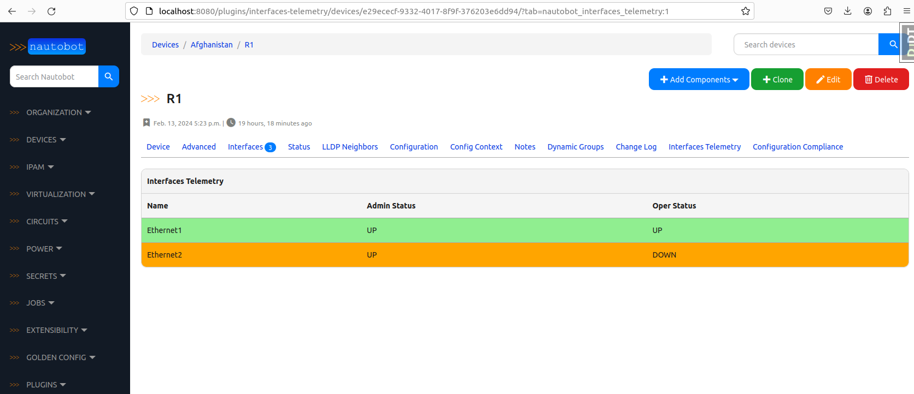

# nautobot-plugin-interfaces-telemetry

## Overview

This is a POC plugin that can serve as an example of how Nautobot core functionality can be extended with new models and a modified UI.

The idea is to store Interfaces state data in Nautobot—the kind of data that you would usually see in monitoring systems like Grafana.

